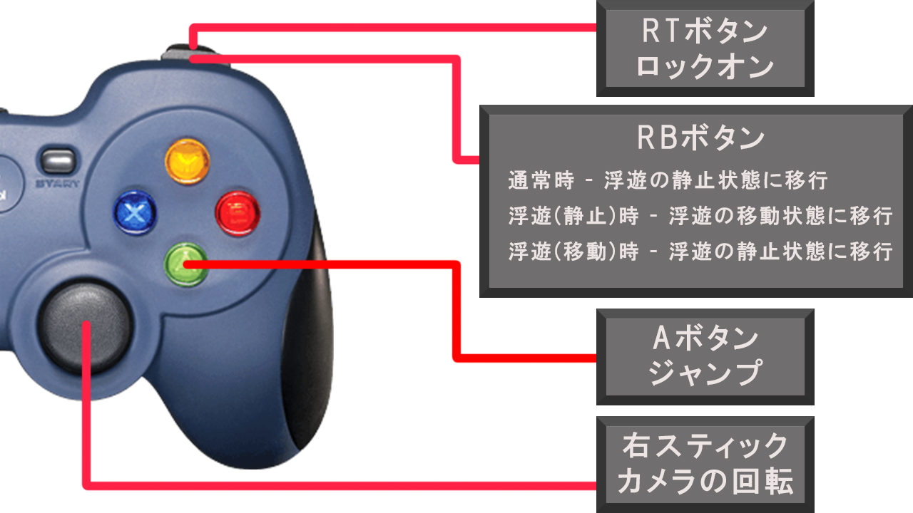
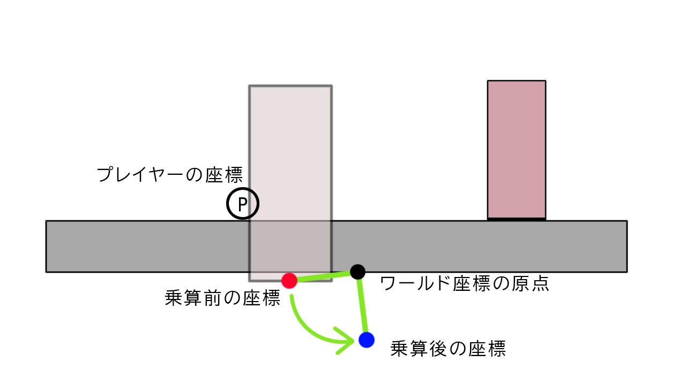

# **PhychicEnergy**

河原電子ビジネス専門学校  

ゲームクリエイター科2年　長山宏毅  

# **目次**

1. [作品概要](#1-作品概要) 
2. [操作説明](#2-操作説明)
3. [担当ソースコード](#3-担当ソースコード)
4. [エンジン側の改造したソースコード](#4-エンジン側の改造したソースコード)
5. [技術紹介](#5-技術紹介)  
  5.1. [世界の回転](#51-世界の回転)  
  5.2. [PBR](#52-pbr)  
  5.3. [輪郭線](#53-輪郭線)

 .

# **1. 作品概要**
## **PhychicEnergy**
&emsp;三人称視点のタイムアタック型のアクションゲームです。  
&emsp;プレイヤーはモードを変更することで浮遊することができます。  
&emsp;浮遊状態の時にオブジェクトに向かって飛ぶことによってぶつかった場所に張り付くことができます。  
&emsp;この力を駆使して、短い時間でマップ上にある全てのリングを取得することが目的です。  
 

- 制作人数  
  - 1人
- プレイ人数
  - 1人  
- 制作期間
  - 2022年9月～2023年2月
  
- 開発環境
  - OS
    - Windows 10
  - エンジン
    - 学校内製の低レベルエンジンを改造したもの(DirectX 12)
  - ツール
    - プログラミング
      - Visual Studio 2019
    - モデル
      - 3ds Max 2020
      - VRoid
    - テクスチャ
      - Adobe Photoshop 2023
    - エフェクト
      - Effekseer
    - データ管理
      - git
    - タスク・スケジュール管理
      - Notion

 
 

# **2. 操作説明**
### **Xboxコントローラー**

- LTボタン - スライディング
- LBボタン - 浮遊状態を解除
- 左スティック - 移動
- 右スティック - カメラを回転
- RBボタン
  - 通常時 - 浮遊の静止状態に移行
  - 浮遊の静止時 - カメラの方向に向かって移動
  - 浮遊の移動時 - 浮遊の静止状態に移行
- RTボタン - ロックオン
- Aボタン - ジャンプ

# **3. 担当ソースコード**

メイン側ソースコード(.h , .cpp)

- Title
  - Title
    - Title.h
    - Title.cpp
  - BackGround
    - TitleBackGround.h
    - TitleBackGround.cpp
  - Camera
    - TitleCamera.h
    - TitleCamera.cpp
  - Sprite
    - TitleSprite.h
    - TitleSprite.cpp
  - BGM
    - TitleBGM.h
    - TitleBGM.cpp
  - Character
    - TitleCharacter.h
    - TitleCharacter.cpp
- InGame
  - Game
    - Game.h
    - Game.cpp
  - Player
    - IPlayerState.h
    - Player.h
    - Player.cpp
    - PlayerIdleState.h
    - PlayerIdleState.cpp
    - PlayerWalkState.h
    - PlayerWalkState.cpp
    - PlayerJumpState.h
    - PlayerJumpState.cpp
    - PlayerSlideState.h
    - PlayerSlideState.cpp
    - PlayerFallState.h
    - PlayerFallState.cpp
    - PlayerIdleInAirState.h
    - PlayerIdleInAirState.cpp
    - PlayerFallInAirState.h
    - PlayerFallInAirState.cpp
  - Ring
    - Ring.cpp
    - Ring.h
  - BGM
    - MainBGM.h
    - MainBGM.cpp
  - Fade
    - Fade.h
    - Fade.cpp
  - Timer
    - DisplayGameTimer.h
    - DisplayGameTimer.cpp
  - LockOn
    - LockOn.h
    - LockOn.cpp
  - GravityGauge
    - GravityGauge.h
    - GravityGauge.cpp
  - Sight
    - Sight.h
    - Sight.cpp
  - BackGround
    - BackGround.h
    - BackGround.cpp
  - Camera
    - GameCamera.h
    - GameCamera.cpp
- Result
  - Result
    - Result.h
    - Result.cpp
  - BGM
    - ResultBGM.h
    - ResultBGM.cpp
  - Sprite
    - ResultSprite.h
    - ResuleSprite.cpp
    

エンジン側ソースコード(.h , .cpp)

- RenderingEngine
  - RenderingEngine.h
  - RenderingEngine.cpp
- ModelRender
  - ModelRender.h
  - ModelRender.cpp
- Level
  - MapChipRender.h
  - MapChipRender.cpp
  - LevelRender.h
  - LevelRender.cpp
- PostEffect
  - PostEffect.h
  - PostEffect.cpp
  - OutLine.h
  - OutLine.cpp
  - Fxaa.h
  - Fxaa.cpp
- Lighting
  - SceneLight.h
  - SceneLight.cpp
  - MyRenderer.h
- Geometry
  - GeometryData.h
  - GeometryData.cpp
  - SceneGeometryData.h
  - SceneGeometryData.cpp
- SkyCube
  - SkyCube.h
  - SkyCube.cpp
- Shadow
  - ShadowMapRender.h
  - ShadowMapRender.cpp
  - CascadeShadowMapMatrix.h
  - CascadeShadowMapMatrix.cpp
- Camera
  - SpringCamera.h
  - SpringCamera.cpp
  - CameraCollisionSolver.h
  - CameraCollisionSolver.cpp
- SpriteRender
  - SpriteRender.h
  - SpriteRender.cpp
- ToonMap
  - ToonMap.h
  - ToonMap.cpp
- WorldRotation
  - WorldRotation.h
  - WorldRotation.cpp

シェーダー(.fx)

- fxaa.fx
- outline.fx
- blackBackModel.fx
- depthForOutLine.fx
- drawShadowMap.fx
- gravityGauge.fx
- pbr.fx
- redBackModel.fx
- ring.fx
- toomModel.fx
- SkyCubeMap.fx

 

# **4. エンジン側の改造したソースコード**

ソースコード

- CharacterController
  - CharacterController.cpp  
  ※接触している面の法線を取得できるように変更
- Matrix 
  - Matrix.h  
  ※行列同士の比較がするために==を使えるように変更
- Vector
  - Vector.h  
  ※Vector4クラスにLerp関数を追加し、線形補間をできるように変更

 

# **5. 技術紹介**

## **5.1. 世界の回転**  

## 回転方法

1. 回転に使用する回転行列を作成する。
2. プレイヤーのワールド行列から平行移動成分を抽出し行列とする。
3. 2で作成した平行移動行列から逆行列を計算する。
4. 回転させるオブジェクトのワールド行列に対して、3で計算したプレイヤーの平行移動行列の逆行列を乗算する。
5. 4で計算された行列に対して、1で作成した回転行列を乗算する。  
6. 5で計算された行列に対して、2で計算したプレイヤーの平行移動行列を乗算する。

 
 

### 4. 回転させるオブジェクトのワールド行列に対して、3で計算したプレイヤーの平行移動行列の逆行列を乗算する。  

 

 

**プレイヤーの平行移動行列の逆行列** とは、 **「プレイヤーの平行移動行列に乗算するとプレイヤーがワールド座標の原点に移動する行列」** のことです。

よってプレイヤーの平行移動行列の逆行列を乗算した場合、オブジェクトがこのように移動する。
  
この座標はプレイヤーが世界の原点であると仮定した場合の座標となる。

 

### 5. 4で計算された行列に対して、1で作成した回転行列を乗算する。

オブジェクトを90度回転させる回転行列の場合

ワールド座標の原点を中心として回転するため、

**乗算前のワールド座標と乗算後のワールド座標では原点に対しての距離が変わらない。**  

 

### 6. 5で計算された行列に対して、2で計算したプレイヤーの平行移動行列を乗算する。

プレイヤーの平行移動行列を乗算する理由としては、現在はプレイヤーを世界の原点と仮定した計算を行ったワールド座標となっているため、プレイヤーの平行移動行列の逆行列の逆行列である、プレイヤーの平行移動行列を乗算することで、世界の原点を元のワールド座標の原点とした時のワールド座標にしている。

 
 

### 計算後

## **5.2. PBR**

## **5.3. 輪郭線**
  
このゲームでは、

  - ポストエフェクトによる輪郭線
  - フロントカリングを行ったモデルで作る輪郭線  

の2種類が実装されているハイブリッド輪郭線となっています。

### **2種類にする利点**
