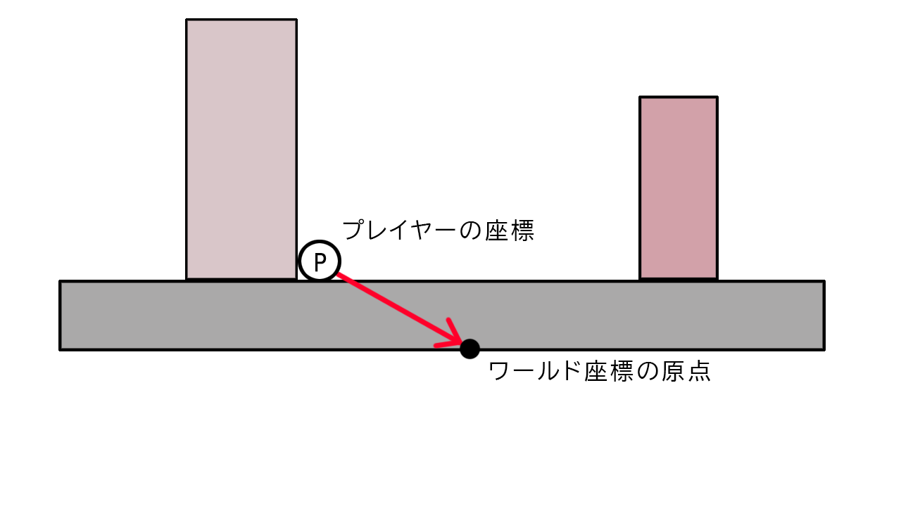
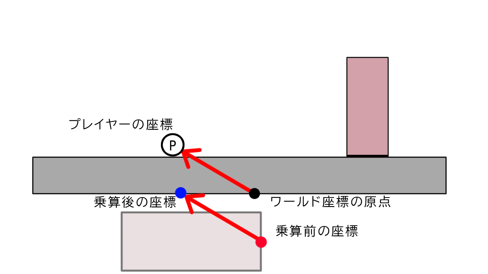
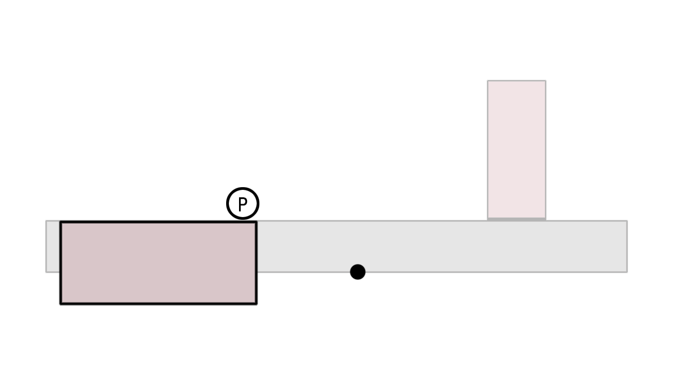
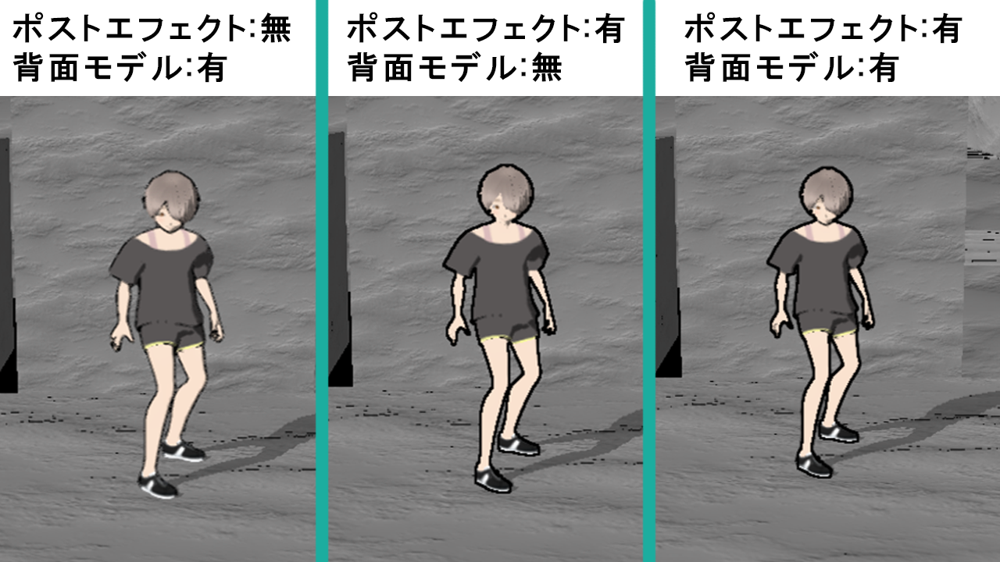
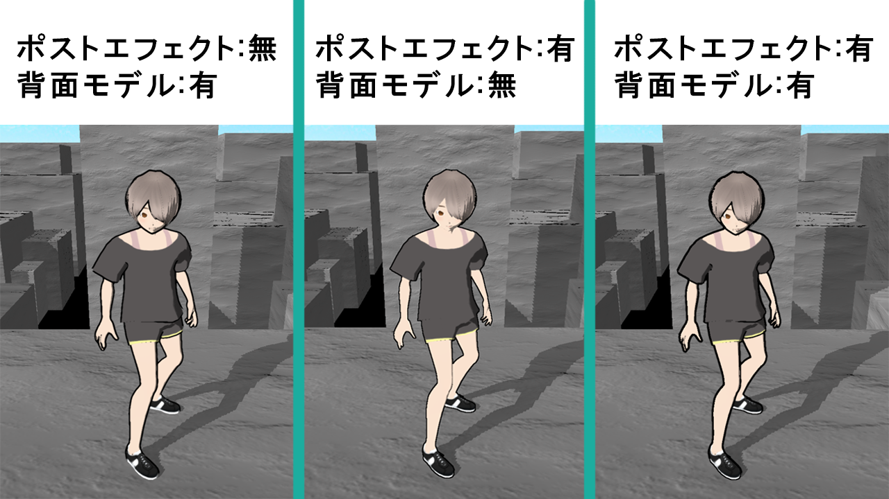
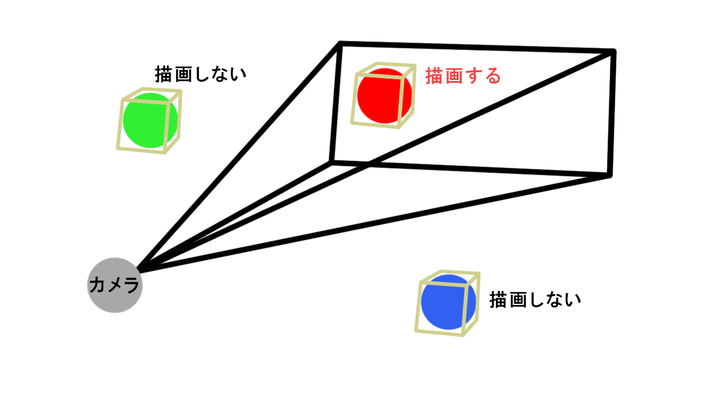
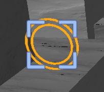
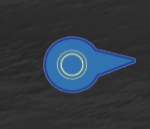

<head>

</head>

<body style="background-color: #gray">

# **PhychicEnergy**

河原電子ビジネス専門学校  

ゲームクリエイター科2年　長山宏毅  

# **目次**

1. [作品概要](#1-作品概要) 
2. [操作説明](#2-操作説明)
3. [担当ソースコード](#3-担当ソースコード)
4. [エンジン側の改造したソースコード](#4-エンジン側の改造したソースコード)
5. [技術紹介](#5-技術紹介)  
  5.1. [世界の回転](#51-世界の回転)   
  5.2. [輪郭線](#52-輪郭線)   
  5.3. [フラスタムカリング](#53-フラスタムカリング)  
  5.4. [カスケードシャドウ](#54-カスケードシャドウ)  
  5.5. [トゥーンシェーディング]()  
  5.6. 
6. [こだわった点](#6-こだわった点)  
  6.1. [世界を回転させた理由](#61-世界を回転させた理由)  
  6.2. [プレイヤーの動きの軽やかさ](#62-プレイヤーの動きの軽やかさ)   
  6.2. [ロックオン機能](#62-ロックオン機能)  
  6.3. [カメラによるストレスを減らすために](#63-カメラによるストレスを減らすために)

 .

# **1. 作品概要**
## **PhychicEnergy**
&emsp;三人称視点のタイムアタック型のアクションゲームです。  
&emsp;プレイヤーはモードを変更することで浮遊することができます。  
&emsp;浮遊状態の時にオブジェクトに向かって飛ぶことによってぶつかった場所に張り付くことができます。  
&emsp;この力を駆使して、短い時間でマップ上にある全てのリングを取得することが目的です。  
 

- 制作人数  
  - 1人
- プレイ人数
  - 1人  
- 制作期間
  - 2022年9月～2023年2月
  
- 開発環境
  - OS
    - Windows 10
  - エンジン
    - 学校内製の低レベルエンジンを改造したもの(DirectX 12)
  - ツール
    - プログラミング
      - Visual Studio 2019
    - モデル
      - 3ds Max 2020
      - VRoid
    - テクスチャ
      - Adobe Photoshop 2023
    - エフェクト
      - Effekseer
    - データ管理
      - git
    - タスク・スケジュール管理
      - Notion

- URL
  - [GitHub](https://github.com/KoukiNagayama/PhychicEnergy)
 
 

# **2. 操作説明**
### **Xboxコントローラー**

- LTボタン - スライディング
- LBボタン - 浮遊状態を解除
- 左スティック - 移動
- 右スティック - カメラを回転
- RBボタン
  - 通常時 - 浮遊の静止状態に移行
  - 浮遊の静止時 - カメラの方向に向かって移動
  - 浮遊の移動時 - 浮遊の静止状態に移行
- RTボタン - ロックオン
- Aボタン - ジャンプ

&emsp;

&emsp;

# **3. 担当ソースコード**

メイン側ソースコード(.h , .cpp)

- Title
  - Title
    - Title.h
    - Title.cpp
  - BackGround
    - TitleBackGround.h
    - TitleBackGround.cpp
  - Camera
    - TitleCamera.h
    - TitleCamera.cpp
  - Sprite
    - TitleSprite.h
    - TitleSprite.cpp
  - BGM
    - TitleBGM.h
    - TitleBGM.cpp
  - Character
    - TitleCharacter.h
    - TitleCharacter.cpp
- InGame
  - Game
    - Game.h
    - Game.cpp
  - Player
    - IPlayerState.h
    - Player.h
    - Player.cpp
    - PlayerIdleState.h
    - PlayerIdleState.cpp
    - PlayerWalkState.h
    - PlayerWalkState.cpp
    - PlayerJumpState.h
    - PlayerJumpState.cpp
    - PlayerSlideState.h
    - PlayerSlideState.cpp
    - PlayerFallState.h
    - PlayerFallState.cpp
    - PlayerIdleInAirState.h
    - PlayerIdleInAirState.cpp
    - PlayerFallInAirState.h
    - PlayerFallInAirState.cpp
  - Ring
    - Ring.cpp
    - Ring.h
  - BGM
    - MainBGM.h
    - MainBGM.cpp
  - Fade
    - Fade.h
    - Fade.cpp
  - Timer
    - DisplayGameTimer.h
    - DisplayGameTimer.cpp
  - LockOn
    - LockOn.h
    - LockOn.cpp
  - GravityGauge
    - GravityGauge.h
    - GravityGauge.cpp
  - Sight
    - Sight.h
    - Sight.cpp
  - BackGround
    - BackGround.h
    - BackGround.cpp
  - Camera
    - GameCamera.h
    - GameCamera.cpp
- Result
  - Result
    - Result.h
    - Result.cpp
  - BGM
    - ResultBGM.h
    - ResultBGM.cpp
  - Sprite
    - ResultSprite.h
    - ResuleSprite.cpp
    

エンジン側ソースコード(.h , .cpp)

- RenderingEngine
  - RenderingEngine.h
  - RenderingEngine.cpp
- ModelRender
  - ModelRender.h
  - ModelRender.cpp
- Level
  - MapChipRender.h
  - MapChipRender.cpp
  - LevelRender.h
  - LevelRender.cpp
- PostEffect
  - PostEffect.h
  - PostEffect.cpp
  - OutLine.h
  - OutLine.cpp
  - Fxaa.h
  - Fxaa.cpp
- Lighting
  - SceneLight.h
  - SceneLight.cpp
  - MyRenderer.h
- Geometry
  - GeometryData.h
  - GeometryData.cpp
  - SceneGeometryData.h
  - SceneGeometryData.cpp
- SkyCube
  - SkyCube.h
  - SkyCube.cpp
- Shadow
  - ShadowMapRender.h
  - ShadowMapRender.cpp
  - CascadeShadowMapMatrix.h
  - CascadeShadowMapMatrix.cpp
- Camera
  - SpringCamera.h
  - SpringCamera.cpp
  - CameraCollisionSolver.h
  - CameraCollisionSolver.cpp
- SpriteRender
  - SpriteRender.h
  - SpriteRender.cpp
- ToonMap
  - ToonMap.h
  - ToonMap.cpp
- WorldRotation
  - WorldRotation.h
  - WorldRotation.cpp

シェーダー(.fx)

- fxaa.fx
- outline.fx
- blackBackModel.fx
- depthForOutLine.fx
- drawShadowMap.fx
- gravityGauge.fx
- pbr.fx
- redBackModel.fx
- ring.fx
- toomModel.fx
- SkyCubeMap.fx

 

# **4. エンジン側の改造したソースコード**

ソースコード

- CharacterController
  - CharacterController.cpp  
  ※接触している面の法線を取得できるように変更
- Matrix 
  - Matrix.h  
  ※行列同士の比較をするために==を使えるように変更
- Vector
  - Vector.h  
  ※Vector4クラスにLerp関数を追加し、線形補間をできるように変更
- Physics
  - Physics.cpp   
  ※MyRayResultCallback構造体とRayTest関数を改造し、レイから衝突点の法線を取得できるように変更。

 

# **5. 技術紹介**

## **5.1. 世界の回転**  

## 回転方法

1. 回転に使用する回転行列を作成する。
2. プレイヤーのワールド行列から平行移動成分を抽出し行列とする。
3. 2で作成した平行移動行列から逆行列を計算する。
4. 回転させるオブジェクトのワールド行列に対して、3で計算したプレイヤーの平行移動行列の逆行列を乗算する。
5. 4で計算された行列に対して、1で作成した回転行列を乗算する。  
6. 5で計算された行列に対して、2で計算したプレイヤーの平行移動行列を乗算する。

 
 

### 4. 回転させるオブジェクトのワールド行列に対して、3で計算したプレイヤーの平行移動行列の逆行列を乗算する。  

 

 

**プレイヤーの平行移動行列の逆行列** とは、 **「プレイヤーの平行移動行列に乗算するとプレイヤーがワールド座標の原点に移動する行列」** のことです。

&emsp;  

よってプレイヤーの平行移動行列の逆行列を乗算した場合、オブジェクトがこのように移動する。

&emsp;    

この座標はプレイヤーが世界の原点であると仮定した場合の座標となる。

 

### 5. 4で計算された行列に対して、1で作成した回転行列を乗算する。

オブジェクトを90度回転させる回転行列の場合

&emsp;  

ワールド座標の原点を中心として回転するため、

**乗算前のワールド座標と乗算後のワールド座標では原点に対しての距離が変わらない。**  

 

### 6. 5で計算された行列に対して、2で計算したプレイヤーの平行移動行列を乗算する。

&emsp;  

プレイヤーの平行移動行列を乗算する理由としては、現在はプレイヤーを世界の原点と仮定した計算を行ったワールド座標となっているため、プレイヤーの平行移動行列の逆行列の逆行列である、プレイヤーの平行移動行列を乗算することで、世界の原点を元のワールド座標の原点とした時のワールド座標にしている。  
 

### 計算後

&emsp;

 

## **5.2. 輪郭線**
  
このゲームでは、

  - ポストエフェクトによる輪郭線
  - フロントカリングを行ったモデルを法線方向に拡張して作る背面モデル輪郭線  

の2種類が実装されているハイブリッド輪郭線となっている。

### **2種類にする利点**
2つの輪郭線はそれぞれ細かく違う特徴を持っている。
その中でも今回注目した違いは以下の通りとなっている。
- ポストエフェクトの場合
  - 対象とカメラの距離に関係なく、描画される輪郭線の大きさは指定された大きさから変化しない。
- フロントカリングを行ったモデルから作る場合
  - 対象とカメラの距離によって、描画される輪郭線の大きさが変化する。

 

**[対象とカメラが遠い場合]**
&emsp;  
 
背面モデルの輪郭線が小さくてもポストエフェクトの輪郭線がある為、最低限の大きさが確保されており、見えやすい。 

 

**[対象とカメラが近い場合]**
&emsp;  
 
背面モデルが目立つようになっている為、ポストエフェクトが見えなくなっている。

 

## 手順  

- ポストエフェクト
  
1. 輪郭線を適用するオブジェクトの深度値をレンダリングテクスチャに書き込む。
2. 1で深度値を書き込んだレンダリングテクスチャから対象ピクセルの周りのピクセルとの深度の違いを検出する。
3. 深度の違いの平均が大きい場合は対象ピクセルは輪郭であると判断する。 
4. 輪郭であると判断された場合には、ピクセルを塗りつぶす。

- 背面モデル
  
1. 輪郭線を適用するオブジェクトのモデルと同じモデルをフロントカリングして同じ座標に設定する。
2. 法線方向に拡張する。
3. モデルを全て黒で出力する。

 

## **5.3. フラスタムカリング**

このゲームでは、オブジェクトを多く配置しているため、1フレームで全てを描画していると処理落ちしてしまうため、必要なオブジェクトは描画しないように減らす必要がある。

 

フラスタムカリングは、カメラからの視錐台の範囲内にオブジェクトのAABB(軸平行境界ボックス)の頂点があるかどうかを判断し、それによって描画するかどうかを確定する。

&emsp;

## 手順  

1. カメラの情報から作成した透視変換行列とカメラのビュー行列からビュープロジェクション行列を計算する。  
2. オブジェクトに割り当てているAABBの頂点のワールド座標を計算する。
3. 2で計算したワールド座標に対して、1で計算したビュープロジェクション行列を乗算し、ビュープロジェクション空間の座標に変換する。  
4. AABBの頂点座標が既定値の範囲にあれば描画する。

 

## **5.4. カスケードシャドウ**

カスケードシャドウは、カメラに対して近いエリアの影を鮮明に描画し、遠いエリアの影ほど品質を下げるという手法。  

具体的な内容としては、分割するエリアの数だけシャドウマップを用意し、エリアに合ったシャドウマップに対して、エリアのオブジェクトを描画し、シャドウマップを作成する。影を適用させる際も、ピクセルがシャドウマップに含まれているのかどうかを判断し、エリアに合わせる。

## 手順

1. 分割エリアの定義を行う。
2. 1で行った定義に合わせてシャドウマップを用意する。
3. ライトカメラから見たエリアを内包する視錐台の8頂点を計算する。
4. クロップ行列を計算する。
5. ライトビュープロジェクション行列に4で求めたクロップ行列を乗算する。

(ここからシェーダー)  

6. 5で求めたライトビュープロジェクションクロップ行列からピクセルのライトビュースクリーン空間の座標を計算する。
7. 6で求めた座標を用いて、ピクセルがどのシャドウマップに含まれているかを確定させて、影を落とす。　　

# **6. こだわった点**

## **6.1. 世界を回転させた理由**

始めはプレイヤーに合わせて世界を回転させる手法ではなく、プレイヤー自体を回転させるという手法に挑戦していた。プレイヤー自体を回転させるということは「プレイヤーの当たり判定を逐一変化する」ということとなるため、ある角度では壁や床の判定が取れていなかったり、めり込まないような修正ができていなかったりなどの問題が発生した。  
そのため、**世界側を回転させることで、プレイヤーの当たり判定を変化させなくともよい**ということになった。

 

## **6.2. ロックオン機能**

このゲームのロックオン機能は、カメラで追うのではなく、目標を見失わないようにどこを見ていても分かりやすくするというものとなっている。 
 

&emsp;**[画面内に目標がある場合]**  
&emsp;  

&emsp;**[画面内に目標がない場合]**  
&emsp;  
(目標のスクリーン座標が画面右側の外にある場合)
  
   

このようにした理由としては、プレイヤーのプレイスタイルに幅がなくなってしまうためとなっている。    
もし、カメラが目標に対して固定されてしまうと、浮遊状態での移動の特徴として、カメラの中心に飛んでいくという性質があるため、プレイヤーはただロックオンをして飛ぶだけで目標に到達することが可能となってしまう。  
そうではなく、目標以外を狙うということも可能にしつつ、目標が画面外に出た場合には見失わないようということにを重視した結果このような形式となった。

 

## **6.3. カメラによるストレスを減らすために**

## 手順

1. 

## **6.2. プレイヤーの動きの軽やかさ**

このゲームは、プレイヤーが浮遊をすることや壁に張り付くことなど通常の床に触れている時間が非常に少ない。そのため、プレイするユーザー自身もプレイをしていて「ふわっ」というような感覚を味わえるようにプレイヤーのジャンプや浮遊状態の時は上昇中や下降中は素早く、最高到達点での動きはゆっくりとなるようにしている。

ランプテクスチャ

